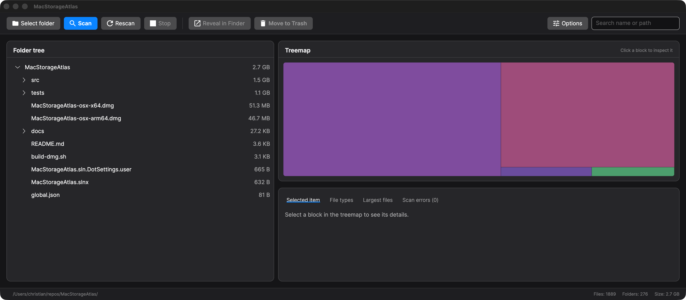
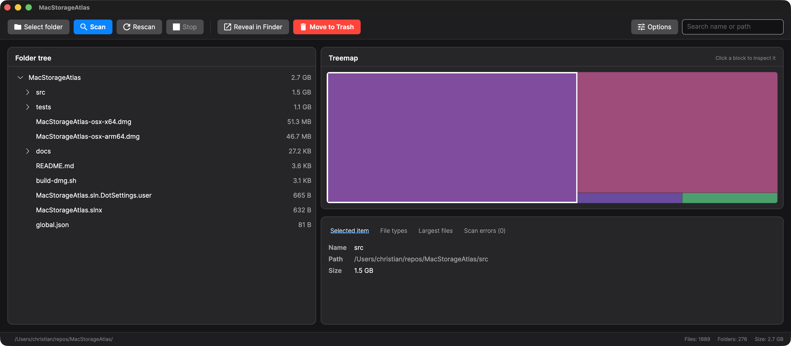
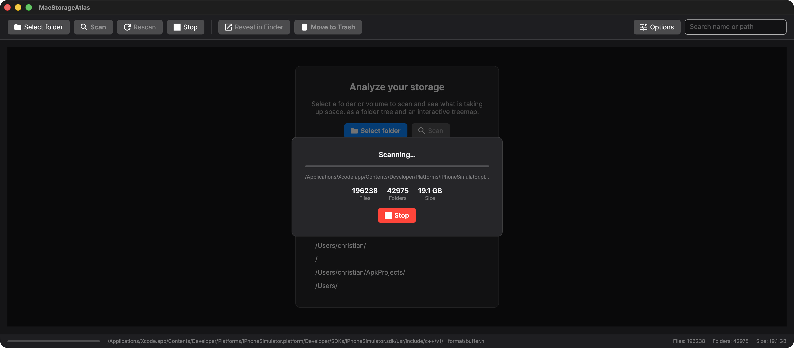
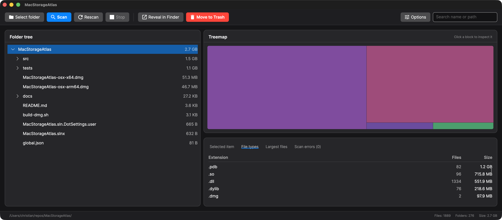
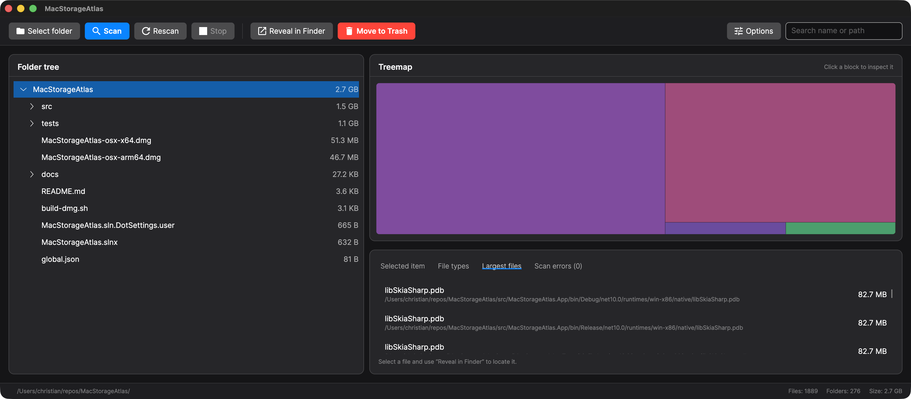
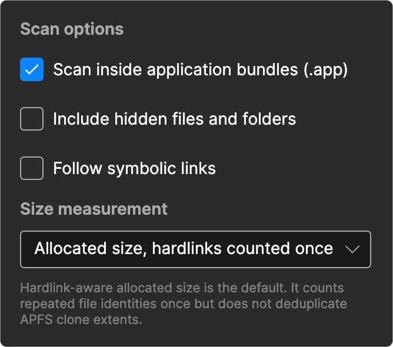

# MacStorageAtlas

> **See what's eating your disk — at a glance.** A fast, native macOS disk usage
> analyzer that turns a folder or volume into a sortable tree and an interactive
> treemap, so you can find the space hogs and reclaim gigabytes in seconds.


**MacStorageAtlas** is a free, open-source **disk space analyzer for macOS** — a
native **WinDirStat, DaisyDisk, and GrandPerspective alternative** for Apple
Silicon and Intel Macs. If you're wondering *what is using my disk space on Mac*
and want to *free up storage*, it scans folders and volumes and visualizes the
results as a sortable folder tree, a proportional treemap, file-type statistics,
and a list of the largest files — so you can find the space hogs and reclaim
gigabytes in seconds.



## Highlights

### 🗺️ Folder tree + interactive treemap, side by side

Every scan gives you two synchronized views: a folder tree sorted by size and a
proportional treemap where the biggest blocks are the biggest consumers. Click a
block to inspect it — name, full path, and size — and jump straight to it.



### ⚡ Live progress, and stop whenever you want

Scanning is fully async and streams progress as it runs: current path, file and
folder counts, and bytes scanned so far. Big volumes (hundreds of thousands of
files) stay responsive, and a single click cancels — partial results stay
visible.



### 📊 Breakdown by file type and largest files

Two dedicated tabs answer the questions that matter: *which kinds of files take
up the most room?* and *what are the single biggest files on disk?* — each with
counts, sizes, and full paths.

| File types | Largest files |
| --- | --- |
|  |  |

### 🧹 Reveal in Finder or move to Trash — safely

Found something to clean up? Reveal any item in Finder, or move it to the Trash
after a confirmation. Files are never permanently deleted — they go to the Trash,
so nothing is lost by accident.

### ⚙️ Configurable scanning

Fine-tune what gets counted: scan inside `.app` bundles (or treat them as single
items), include hidden files, and follow symbolic links. By default sizes use
the locally allocated blocks for each visited path, so undownloaded cloud
placeholders count as roughly zero — switch to logical file length if you
prefer. Hardlink and APFS-clone storage is not yet deduplicated; see
[Storage measurement semantics](docs/STORAGE_MEASUREMENT.md). Preferences and
recent scan locations are remembered between runs.



## Features

- Select and scan any folder or volume with live progress reporting, and
  cancel a running scan at any time.
- Browse results as a folder tree sorted by size, or as an interactive treemap.
- See storage broken down by file type and a list of the largest files.
- Search and filter scanned items by name or path.
- Reveal items in Finder or move them safely to the Trash.
- Inspect files and folders that couldn't be scanned, and copy their paths to
  the clipboard.
- Configurable scanning: hidden files, symbolic links, `.app` package
  expansion, and allocated vs. logical size measurement.
- Remembers your scanner preferences and recent scan locations between runs.
- Modern, native-feeling UI that follows the system light/dark appearance, with
  a responsive treemap and a live scan-progress overlay.

> Screenshots above show MacStorageAtlas analyzing its own project folder — build
> artifacts included — which is why `.pdb`, `.dll`, and `.dmg` files dominate the
> breakdown.

> Branding artwork lives under `src/MacStorageAtlas.App/Assets/`: `app.ico` (window
> icon), `icon.png` (1024×1024 master), and `MacStorageAtlas.icns` for macOS app
> bundling.

## How it compares

Looking for a **free DaisyDisk alternative** or a **WinDirStat for Mac**?
MacStorageAtlas focuses on the essentials — a fast scan, a treemap, and safe
cleanup — without a subscription or a price tag.

| Capability | MacStorageAtlas | [DaisyDisk][daisydisk] | [GrandPerspective][grandperspective] | [WinDirStat][windirstat] |
| --- | --- | --- | --- | --- |
| Platform | macOS (Apple Silicon + Intel) | [macOS (Apple Silicon + Intel)][daisydisk-pricing] | [macOS (Apple Silicon + Intel)][grandperspective] | [Windows][windirstat] |
| Distribution | [Free, MIT-licensed open source](LICENSE) | [$9.99 one-time commercial license][daisydisk-pricing] | [Free GPL build; $2.99 App Store build][grandperspective] | [Free, GPLv2 open source][windirstat] |
| Main analysis views | [Folder tree, rectangular treemap, file-type statistics](#highlights) | [Sunburst disk map and sidebar list][daisydisk-map] | [Rectangular treemap][grandperspective] | [Directory/file lists, treemap, and extension statistics][windirstat] |
| File-size measurement | [Logical length or allocated blocks per visited path](src/MacStorageAtlas.Core/NativeFileSize.cs) | [Physical size; hardlinks and full APFS clones are counted once][daisydisk-hardlinks] | [Logical, physical, or file-count sizing][grandperspective-sizes]; [hardlinks counted once per view][grandperspective-hardlinks] | [Logical or physical sizing with hardlink deduplication][windirstat-source] |

**Storage-measurement note:** these products do not use one interchangeable
definition of “real size.” MacStorageAtlas allocated-size mode sums filesystem
blocks for each visited path. It handles sparse files and local cloud
placeholders, but it does not yet deduplicate hardlinks or APFS clone storage;
that work is tracked in [WP-02](docs/IMPLEMENTATION_ROADMAP.md#wp-02---hardlinkapfs-correctness-and-scan-benchmarks).
DaisyDisk documents full APFS-clone detection on macOS 14 Sonoma and later.

Comparison last verified against the linked first-party sources: **2026-07-24**.
Prices and capabilities can change; follow the links for current product
details.

[daisydisk]: https://daisydiskapp.com/
[daisydisk-pricing]: https://daisydiskapp.com/support/pricing/
[daisydisk-map]: https://daisydiskapp.com/guide/4/en/UnderstandingSunburst/
[daisydisk-hardlinks]: https://daisydiskapp.com/guide/4/en/HardLinks
[grandperspective]: https://grandperspectiv.sourceforge.net/
[grandperspective-sizes]: https://grandperspectiv.sourceforge.net/HelpDocumentation/FileSizes.html
[grandperspective-hardlinks]: https://grandperspectiv.sourceforge.net/HelpDocumentation/HardLinks.html
[windirstat]: https://windirstat.net/
[windirstat-source]: https://github.com/windirstat/windirstat

## Prerequisites

- macOS
- [.NET 10 SDK](https://dotnet.microsoft.com/download)
- Avalonia templates are **not** required to build or run; all dependencies are
  restored from NuGet.

## Build

```shell
dotnet restore
dotnet build --no-restore
```

## Test

```shell
dotnet test --no-build
```

## Run

```shell
dotnet run --project src/MacStorageAtlas.App
```

## Package (DMG)

Run the packaging script from the repository root. It publishes a self-contained
Release build, wraps it in a `MacStorageAtlas.app` bundle (with the `.icns` app
icon), and creates a DMG with a drag-to-`Applications` shortcut.

```shell
./build-dmg.sh            # Apple Silicon (default) → MacStorageAtlas.dmg
./build-dmg.sh arm64      # Apple Silicon (osx-arm64)
./build-dmg.sh x64        # Intel (osx-x64)
./build-dmg.sh both       # both architectures, one DMG each
```

When building `both`, the DMGs are named per architecture
(`MacStorageAtlas-osx-arm64.dmg` and `MacStorageAtlas-osx-x64.dmg`). Each build
is self-contained and does **not** run under Rosetta on the other architecture —
pick the DMG that matches the target Mac.

> ⚠️ **Unsigned & un-notarized build**
>
> This DMG is **not code-signed or notarized**, because the project has no paid
> Apple Developer account. macOS Gatekeeper will therefore block the app on
> first launch ("MacStorageAtlas is damaged and can't be opened" / "cannot be
> opened because Apple cannot check it for malicious software").
>
> To run it anyway, either:
>
> - Right-click the app in `/Applications` → **Open** → confirm **Open** in the
>   dialog, or
> - Remove the quarantine attribute from a terminal:
>
>   ```shell
>   xattr -dr com.apple.quarantine /Applications/MacStorageAtlas.app
>   ```
>
> Only do this for builds you trust and compiled yourself.

## Project structure

```text
src/
  MacStorageAtlas.App              Avalonia UI and MVVM shell
  MacStorageAtlas.Core             disk scanning and domain logic
  MacStorageAtlas.Rendering        treemap layout logic
  MacStorageAtlas.Platform.Mac     macOS-specific integrations (reveal, trash, dock icon)

tests/
  MacStorageAtlas.Tests            NUnit tests
```

## Documentation

- Product backlog and feature specifications: [`docs/FEATURES.md`](docs/FEATURES.md)
- Market-driven implementation roadmap: [`docs/IMPLEMENTATION_ROADMAP.md`](docs/IMPLEMENTATION_ROADMAP.md)
- Storage measurement semantics and verification: [`docs/STORAGE_MEASUREMENT.md`](docs/STORAGE_MEASUREMENT.md)
- OpenSpec feature workflow: [`docs/OPENSPEC_WORKFLOW.md`](docs/OPENSPEC_WORKFLOW.md)
- macOS packaging and distribution: [`docs/PACKAGING.md`](docs/PACKAGING.md)

## License

Released under the [MIT License](LICENSE).

---

<sub>Keywords: macOS disk usage analyzer · disk space analyzer for Mac · what is
using my disk space on Mac · free up disk space macOS · WinDirStat for Mac ·
DaisyDisk alternative · GrandPerspective alternative · treemap disk visualizer ·
find largest files Mac · Apple Silicon disk cleanup · open source Mac storage
tool.</sub>
