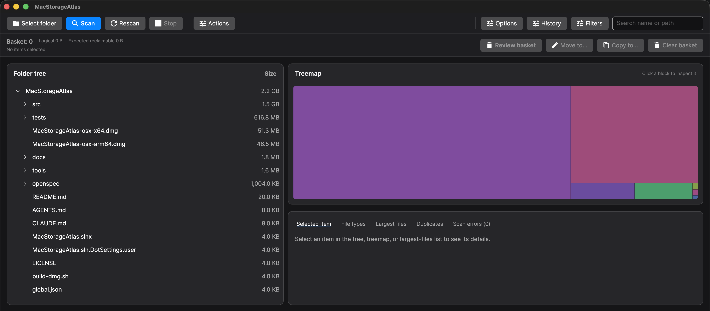
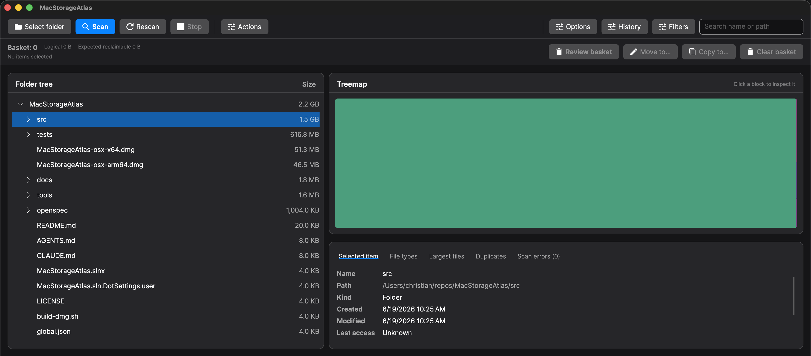
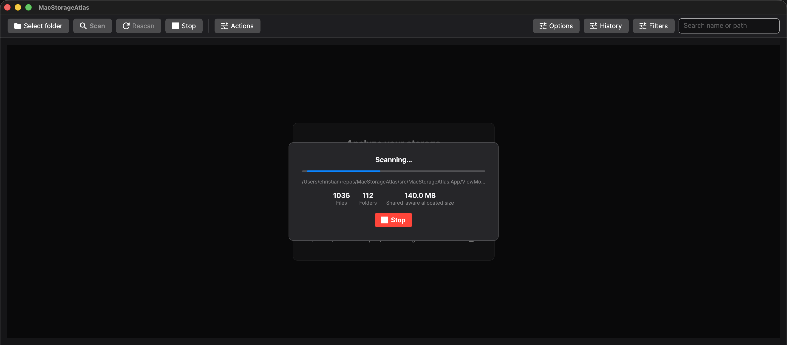
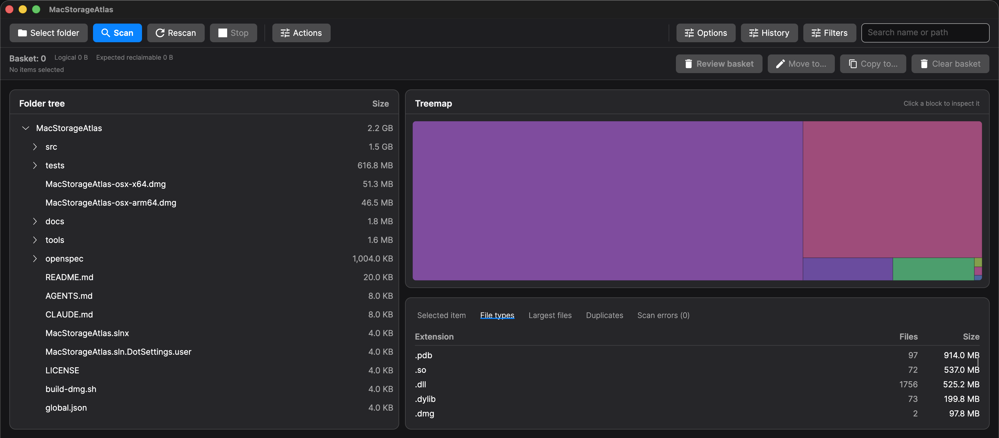
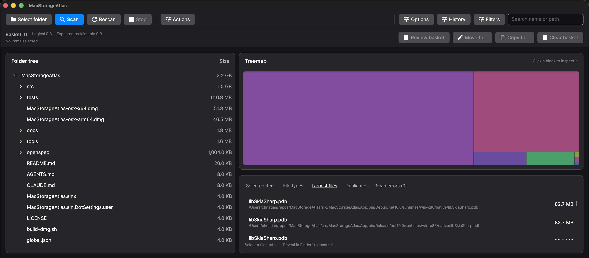
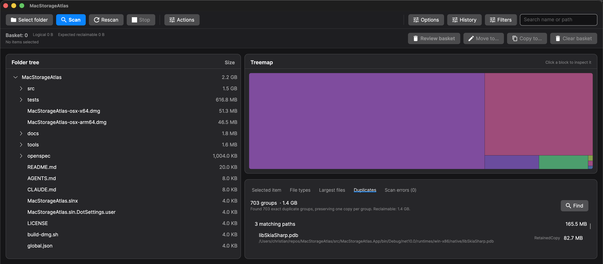
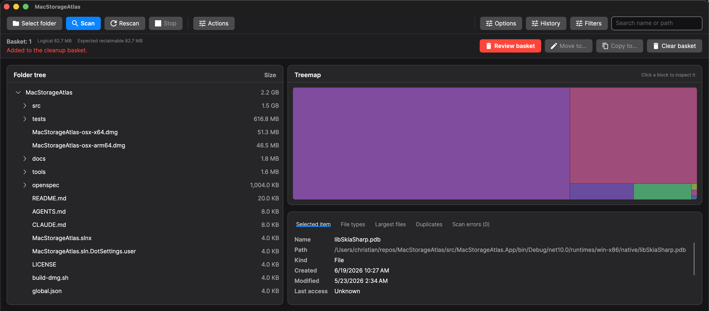

# MacStorageAtlas

> **See what's eating your disk — at a glance.** A fast, native macOS disk usage
> analyzer that turns a folder or volume into a sortable tree and an interactive
> treemap, so you can find the space hogs and reclaim gigabytes in seconds.


**MacStorageAtlas** is a free, open-source **disk space analyzer for macOS** — a
native **WinDirStat, DaisyDisk, and GrandPerspective alternative** for Apple
Silicon and Intel Macs. If you're wondering *what is using my disk space on Mac*
and want to *free up storage*, it scans folders and volumes and visualizes the
results as a sortable folder tree, a proportional treemap, file-type statistics,
and a list of the largest files — so you can find the space hogs and reclaim
gigabytes in seconds.



## Highlights

### 🗺️ Folder tree + interactive treemap, side by side

Every scan gives you two synchronized views: a folder tree sorted by size and a
proportional treemap where the biggest blocks are the biggest consumers. Click a
block to inspect it — name, full path, item kind, scan-time dates, and size —
and jump straight to it.



### ⚡ Live progress, and stop whenever you want

Scanning is fully async and streams progress as it runs: current path, file and
folder counts, and bytes scanned so far. Big volumes (hundreds of thousands of
files) stay responsive, and a single click cancels — partial results stay
visible.



### 📊 Breakdown by file type and largest files

Two dedicated tabs answer the questions that matter: *which kinds of files take
up the most room?* and *what are the single biggest files on disk?* — each with
counts, sizes, and full paths.

| File types | Largest files |
| --- | --- |
|  |  |

### 🧩 Exact duplicate review

After a scan completes, run an opt-in duplicate analysis to find byte-identical
regular files. MacStorageAtlas narrows candidates by current logical length,
samples file edges, hashes surviving content with bounded buffers, and confirms
matches byte for byte before showing them. Analysis can be cancelled, hardlinked
paths are shown as linked paths rather than reclaimable copies, and known
cloud-only placeholders are skipped instead of downloaded. Duplicate entries
can be selected for Quick Look, Finder reveal, and the existing cleanup basket,
but MacStorageAtlas never auto-selects a copy for cleanup.



### 🔎 Preview, reveal, or move to Trash — safely

Found something to inspect? Preview the selected item with Quick Look, reveal it
in Finder, move an eligible item to the Trash after a confirmation, or collect
multiple scanned items in the cleanup basket for a final review. Broad or
sensitive containers are blocked from in-app cleanup with an explanation. Files
are never permanently deleted — approved cleanup items go to the macOS Trash,
and partial failures identify the item that could not be moved.

### 📦 Archive instead of delete

Short on space but not ready to let go? Move or copy the reviewed cleanup basket
to an external or network volume instead of the Trash. The review names the
operation and the destination, and reports the expected locally reclaimed size —
zero for a copy, since a copy frees nothing. Nothing at the destination is ever
replaced: an item whose name already exists there is blocked with a reason
rather than overwritten or auto-renamed. A move across volumes copies first,
verifies the copy, and only then removes the original, so a failed or cancelled
transfer always leaves the source in place.



### ⚙️ Configurable scanning

Fine-tune what gets counted: scan inside `.app` bundles (or treat them as single
items), include hidden files, and follow symbolic links. By default sizes use
shared-aware allocated measurement: repeated hardlink identities count once,
and verified full-clone data counts once on capable volumes. Independently
allocated non-data storage and divergent clone extents remain per identity.
You can instead choose allocated size per path or logical file length. See
[Storage measurement semantics](docs/STORAGE_MEASUREMENT.md) for capability
coverage and scope. Preferences and manageable recent scan locations are
remembered between runs.

## Features

- Select and scan any folder or volume with live progress reporting, and
  cancel a running scan at any time.
- Browse results as a folder tree sorted by size, or as an interactive treemap.
- Inspect selected file and folder metadata captured during the scan, including
  item kind and available created or modified dates.
- Preview the selected item with Quick Look using the toolbar or its Actions
  menu, and use Space or Command-I shortcuts for inspection.
- See storage broken down by file type and a list of the largest files.
- Run opt-in exact duplicate analysis after a scan completes. Duplicate
  analysis reads local file contents only when candidates survive metadata and
  sample checks, can be cancelled, skips known cloud-only placeholders, shows
  hardlinks as linked paths, and lets duplicate entries flow through the same
  Quick Look, Finder reveal, and cleanup-basket review commands as other
  scanned items.
- Search and filter scanned items by name or path, and press Command-F to jump
  to the search box.
- Narrow a completed scan with advanced filters covering size, creation,
  modification and last-access dates, file extension, file category, and
  shared-storage status. Criteria combine with AND, and filtering never
  rescans.
- Set each date bound to a fixed date or to a span before the moment the filter
  runs, such as 18 months ago. A relative bound is stored as the span, so a
  saved preset keeps meaning the same span instead of drifting as time passes.
  The panel shows the date each span resolved to.
- Apply built-in filter presets, or save, rename, delete, and update your own.
  Presets persist between runs, and the panel shows which preset the current
  criteria match and whether they have been edited since.
- See the number of matching files, their total matched size, and how many
  files were excluded because a required date was unknown.
- Export the current result as CSV or JSON to a location you choose. Exporting
  with a filter active writes the matched files only. JSON preserves paths
  exactly and carries the scan's unreadable-path list; CSV is written for
  spreadsheets, with a UTF-8 byte order mark and leading formula characters
  neutralized so no cell executes on open. A cancelled or failed export never
  leaves a partial file behind.
- Optionally record completed scans to a local history, so a later release can
  show what grew or shrank between two points in time. Recording is off until
  you turn it on, snapshots stay on your Mac and never include file contents,
  and the store is capped by snapshot count and total size. You can delete a
  single recorded scan or clear the whole history at any time.
- Reveal items in Finder, move one eligible item to Trash, or review a
  multi-item cleanup basket before moving approved items to Trash. Broad or
  sensitive containers are blocked from in-app cleanup with an explanation.
- Move or copy the reviewed cleanup basket to another volume instead of the
  Trash. Destination free space, read-only destinations, and moves into an
  item's own subtree are checked before the review, colliding names are blocked
  rather than overwritten, and a cross-volume move only removes the original
  after the copy is verified.
- Inspect files and folders that couldn't be scanned, and copy their paths to
  the clipboard.
- Get Full Disk Access guidance when macOS-protected locations make a scan
  appear incomplete, with a shortcut to Privacy & Security, manual fallback
  instructions, and a rescan action.
- Configurable scanning: hidden files, symbolic links, `.app` package
  expansion, and logical, per-path allocated, or shared-aware allocated size
  measurement.
- Remembers your scanner preferences and recent scan locations between runs,
  with controls to remove individual entries or clear the list.
- Modern, native-feeling UI that follows the system light/dark appearance, with
  a responsive treemap and a live scan-progress overlay.

> Completed-result screenshots above show MacStorageAtlas analyzing its own
> project folder — build artifacts included — which is why `.pdb`, `.dll`, and
> `.dmg` files dominate the breakdown.

> Branding artwork lives under `src/MacStorageAtlas.App/Assets/`: `app.ico` (window
> icon), `icon.png` (1024×1024 master), and `MacStorageAtlas.icns` for macOS app
> bundling.

## How it compares

Looking for a **free DaisyDisk alternative** or a **WinDirStat for Mac**?
MacStorageAtlas focuses on the essentials — a fast scan, a treemap, and safe
cleanup — without a subscription or a price tag.

| Capability | MacStorageAtlas | [DaisyDisk][daisydisk] | [GrandPerspective][grandperspective] | [WinDirStat][windirstat] |
| --- | --- | --- | --- | --- |
| Platform | macOS (Apple Silicon + Intel) | [macOS (Apple Silicon + Intel)][daisydisk-pricing] | [macOS (Apple Silicon + Intel)][grandperspective] | [Windows][windirstat] |
| Distribution | [Free, MIT-licensed open source](LICENSE) | [$9.99 one-time commercial license][daisydisk-pricing] | [Free GPL build; $2.99 App Store build][grandperspective] | [Free, GPLv2 open source][windirstat] |
| Main analysis views | [Folder tree, rectangular treemap, file-type statistics](#highlights) | [Sunburst disk map and sidebar list][daisydisk-map] | [Rectangular treemap][grandperspective] | [Directory/file lists, treemap, and extension statistics][windirstat] |
| File-size measurement | [Logical length, allocated blocks per path, or shared-aware allocated blocks](src/MacStorageAtlas.Platform.Mac/MacFileMetadataReader.cs); hardlinks and verified full-clone data count once where capability coverage permits | [Physical size; hardlinks and full APFS clones are counted once][daisydisk-hardlinks] | [Logical, physical, or file-count sizing][grandperspective-sizes]; [hardlinks counted once per view][grandperspective-hardlinks] | [Logical or physical sizing with hardlink deduplication][windirstat-source] |

**Storage-measurement note:** these products do not use one interchangeable
definition of “real size.” MacStorageAtlas handles sparse files and local cloud
placeholders and, by default, counts hardlinks once plus verified full-clone
data once on capable volumes. It does not deduplicate divergent clone extents
and does not claim unique physical or reclaimable storage. The optional
per-path mode counts every visited path. DaisyDisk documents full APFS-clone
detection on macOS 14 Sonoma and later.

Comparison last verified against the linked first-party sources: **2026-08-12**.
Prices and capabilities can change; follow the links for current product
details.

[daisydisk]: https://daisydiskapp.com/
[daisydisk-pricing]: https://daisydiskapp.com/support/pricing/
[daisydisk-map]: https://daisydiskapp.com/guide/4/en/UnderstandingSunburst/
[daisydisk-hardlinks]: https://daisydiskapp.com/guide/4/en/HardLinks
[grandperspective]: https://grandperspectiv.sourceforge.net/
[grandperspective-sizes]: https://grandperspectiv.sourceforge.net/HelpDocumentation/FileSizes.html
[grandperspective-hardlinks]: https://grandperspectiv.sourceforge.net/HelpDocumentation/HardLinks.html
[windirstat]: https://windirstat.net/
[windirstat-source]: https://github.com/windirstat/windirstat

## Prerequisites

- macOS
- [.NET 10 SDK](https://dotnet.microsoft.com/download)
- Avalonia templates are **not** required to build or run; all dependencies are
  restored from NuGet.

## Build

```shell
dotnet restore
dotnet build --no-restore
```

## Test

```shell
dotnet test --no-build
```

## Run

```shell
dotnet run --project src/MacStorageAtlas.App
```

## Package

Run the packaging script from the repository root. It publishes a self-contained
Release build, wraps it in a `MacStorageAtlas.app` bundle (with the `.icns` app
icon), and creates a DMG with a drag-to-`Applications` shortcut.

```shell
./build-dmg.sh            # Apple Silicon (default) → MacStorageAtlas.dmg
./build-dmg.sh arm64      # Apple Silicon (osx-arm64)
./build-dmg.sh x64        # Intel (osx-x64)
./build-dmg.sh both       # both architectures, one DMG each
```

When building `both`, the DMGs are named per architecture
(`MacStorageAtlas-osx-arm64.dmg` and `MacStorageAtlas-osx-x64.dmg`). Each build
is self-contained and does **not** run under Rosetta on the other architecture —
pick the DMG that matches the target Mac.

The default packaging commands produce unsigned development DMGs. Official
public release artifacts use the explicit local Developer ID path, which signs
the app, notarizes and staples the DMG, verifies the result, and writes SHA-256
checksum files:

```shell
./build-dmg.sh release both 1.2.3 \
  "Developer ID Application: Example Company (TEAMID)" \
  "MacStorageAtlas-notary"
```

Release DMGs are named `MacStorageAtlas-<version>-<runtime>.dmg`. See
[Packaging MacStorageAtlas for macOS](docs/PACKAGING.md) for certificate,
notary profile, verification, and GitHub Release upload steps.

## Full Disk Access

macOS can block third-party apps from reading protected locations such as some
Mail, Messages, Safari, Time Machine, and administrative data. When a completed
scan has permission-related inaccessible paths, MacStorageAtlas shows guidance
that the result may be incomplete, keeps the detailed errors visible, and offers
to open Privacy & Security.

Grant access manually in **System Settings > Privacy & Security > Full Disk
Access**, add or enable MacStorageAtlas, restart the app if macOS asks, then
rescan the same location. Inaccessible paths are not purgeable space, free
space, or files that MacStorageAtlas says are safe to delete.

## Project structure

```text
src/
  MacStorageAtlas.App              Avalonia UI and MVVM shell
  MacStorageAtlas.Core             disk scanning and domain logic, grouped by domain folder
  MacStorageAtlas.Rendering        treemap layout logic
  MacStorageAtlas.Platform.Mac     macOS-specific integrations (reveal, trash, dock icon, access guidance)

tests/
  MacStorageAtlas.Core.Tests       Core NUnit tests mirroring Core domain folders
  MacStorageAtlas.Rendering.Tests  Rendering NUnit tests
  MacStorageAtlas.Platform.Mac.Tests macOS integration NUnit tests
  MacStorageAtlas.App.Tests        App and ViewModel NUnit tests
  MacStorageAtlas.Benchmarks.Tests benchmark tooling NUnit tests

tools/
  MacStorageAtlas.Benchmarks       developer scan benchmark command
```

## Documentation

- Product backlog and feature specifications: [`docs/FEATURES.md`](docs/FEATURES.md)
- Market-driven implementation roadmap: [`docs/IMPLEMENTATION_ROADMAP.md`](docs/IMPLEMENTATION_ROADMAP.md)
- Storage measurement semantics and verification: [`docs/STORAGE_MEASUREMENT.md`](docs/STORAGE_MEASUREMENT.md)
- Troubleshooting: [`docs/TROUBLESHOOTING.md`](docs/TROUBLESHOOTING.md)
- Scan benchmark commands and representative results: [`docs/SCAN_BENCHMARKS.md`](docs/SCAN_BENCHMARKS.md)
- OpenSpec feature workflow: [`docs/OPENSPEC_WORKFLOW.md`](docs/OPENSPEC_WORKFLOW.md)
- macOS packaging and distribution: [`docs/PACKAGING.md`](docs/PACKAGING.md)

## License

Released under the [MIT License](LICENSE).

---

<sub>Keywords: macOS disk usage analyzer · disk space analyzer for Mac · what is
using my disk space on Mac · free up disk space macOS · WinDirStat for Mac ·
DaisyDisk alternative · GrandPerspective alternative · treemap disk visualizer ·
find largest files Mac · Apple Silicon disk cleanup · open source Mac storage
tool.</sub>
